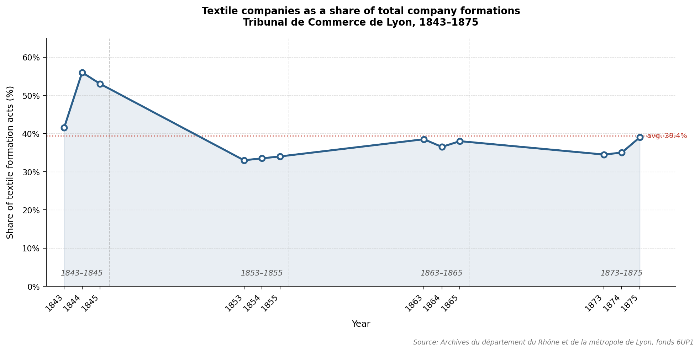

# Textile Industries in Lyon in the Nineteenth Century — Analysis of Company Registration Acts (1843–1875)

> **Industrie tessili a Lione nell'Ottocento: analisi degli atti di società (1843–1875)**
> **Industries textiles à Lyon au XIXᵉ siècle : analyse des actes de société (1843–1875)**

---

## Overview

This repository contains the data, archival sources, and full thesis produced for a joint Master's degree in Historical Sciences (*Scienze Storiche* / *Master 2 Histoire — Construction des Sociétés Contemporaines*) awarded by the **Università degli Studi di Torino** and the **Université Lumière Lyon 2** (Academic Year 2024/2025).

The research analyses the dynamics of the Lyonnais textile sector between 1843 and 1875 through a systematic examination of company formation, modification, and dissolution acts deposited at the **Tribunal de Commerce de Lyon** and preserved at the **Archives du département du Rhône et de la métropole de Lyon** (fonds 6UP1). The study sits at the intersection of economic history, business history, and gender history.

The chart below illustrates one of the central findings: the textile sector's dominant but progressively declining share of total company formations across the four sample periods.

---

## Research Questions

- What was the structural weight of the textile sector in Lyon's entrepreneurial landscape between 1843 and 1875, and how did it evolve relative to other sectors?
- What were the prevailing legal forms, capitalisation levels, and effective lifespans of textile companies?
- To what extent did women participate — formally and financially — in the constitution and dissolution of textile companies, and in what capacities?

---

## Methodology

The research combines **serial quantitative analysis** of juridical sources with a broad historiographical and macroeconomic framing. Four triennial sample periods were selected — 1843–1845, 1853–1855, 1863–1865, and 1873–1875 — to capture medium-term trends across phases of French economic expansion, stagnation, and recovery.

The workflow proceeded in three stages:

1. **Digitisation** — full scanning of all archival units (*unités archivistiques*) corresponding to the sample years
2. **Manual selection and data extraction** — isolation of textile-sector acts and extraction of variables into a structured dataset
3. **Quantitative analysis** — statistical processing and visualisation carried out in **Python** (Jupyter Notebook), using the dataset as the primary input

A total of **1,823 usable acts** were analysed: 1,188 formations (64%) and 635 dissolutions (36%), out of 1,855 textile acts identified in the corpus.

The research was conducted within the framework of the **DIRIVA project** (*Diriger une 'entreprise' (XVIIIe–XXIe siècle) : la valeur du genre*), coordinated by Valérie Boussard, François-Xavier Duduet, Manuela Martini, and Delphine Naudet, and funded by the **ANR** (Agence Nationale de la Recherche, 2024–2028). Data collection was carried out under the supervision of Manuela Martini and Pierre Vernus at the **LARHRA** research centre (Université Lumière Lyon 2).

---

## Key Findings

- The textile sector accounted for **38.4% of all company formations** and **36.1% of all dissolutions** deposited at the Tribunal de Commerce de Lyon across the sample years, with a markedly higher share in the 1840s (exceeding 55% in peak years) and a gradual stabilisation at 33–39% thereafter.
- The **median planned lifespan** of textile companies was approximately six years; the **median effective lifespan** was approximately three years — roughly half the declared duration — indicating structural instability in the sector.
- **Silk** (*soie*) was by far the dominant fibre declared in company objects, consistent with Lyon's role as the world capital of silk manufacturing.
- Women appeared in **11.3% of formation acts** and **12.5% of dissolution acts**, despite representing only 6% of individual signatories. Their participation was predominantly financial rather than managerial: women were proportionally more likely than men to hold the status of *commanditaire* (limited financial partner).
- **Widows** (*veuves*) were the most economically active female category, contributing median capital amounts comparable to those of male partners — a finding consistent with the specific legal autonomy conferred by widowhood under the *Code Napoléon*.

---

## Repository Contents

| File | Description |
|------|-------------|
| `TESI MAGISTRALE VERDUNA-definitivo.pdf` | Full thesis (Italian, with French *résumé*) |
| `MAQUETTE_VERDUNA_git.xlsx` | Partial dataset — representative sample of the database of textile company acts (formations and dissolutions), with all variables extracted during data collection |
| `totale_atti.xlsx` | Monthly counts of total acts and textile-sector acts (both formations and dissolutions) for all sample years, used to compute sectoral shares |
| `CONS_Janvier_1853.pdf` | Archival sample — formation acts, January 1853 |
| `DIS_Fevrier_1853.pdf` | Archival sample — dissolution acts, February 1853 |
| `CONS_DIS_Novembre_1873.pdf` | Archival sample — formation and dissolution acts, November 1873 |
| `testament_pizay.pdf` | Case study source — testament of Jean-Baptiste Pizay |
| `RevocationTestament1859.pdf` | Case study source — revocation of testament (1859), Pizay family |
| `chart_textile_share.png` | Visualisation — textile companies as a share of total formations, 1843–1875 |

> **Note on data completeness:** The full dataset cannot be made publicly available in its entirety due to the confidentiality requirements of the DIRIVA research programme, of which this thesis forms a part. The file `MAQUETTE_VERDUNA_git.xlsx` contains a representative sample sufficient to illustrate the structure, variables, and coding conventions of the complete database. The Jupyter Notebook used for data processing and visualisation is available upon request.

---

## Archival Sources

**Archives du département du Rhône et de la métropole de Lyon**
Fonds 6UP1 — Tribunal de Commerce de Lyon

Archival units consulted:
`6UP1/3001`, `6UP1/3002`, `6UP1/3007`, `6UP1/3008`, `6UP1/3009`, `6UP1/3020`, `6UP1/3021`, `6UP1/3022`, `6UP1/3023`, `6UP1/3024`, `6UP1/3025`, `6UP1/19`, `6UP1/20`, `6UP1/21`, `6UP1/22`, `6UP1/23`, `6UP1/24`, `6UP1/25`, `6UP1/26`, `6UP1/27`

---

## Supervisors

- **Prof. Fabrizio Loreto** — Università degli Studi di Torino *(relatore)*
- **Prof. Manuela Martini** — Université Lumière Lyon 2 *(correlatrice)*
- **Prof. Pierre Vernus** — Université Lumière Lyon 2 *(collaboratore scientifico)*

---

## How to Cite

If you wish to reference this work or the dataset in academic publications, please use the following citation:

> Verduna, Alessandro. *Industrie tessili a Lione nell'Ottocento: analisi degli atti di società (1843–1875)*. Master's thesis, Università degli Studi di Torino / Université Lumière Lyon 2, Academic Year 2024/2025. Available at: https://github.com/AlessandroVerduna/thesis-textile-lyon

---

## License

The thesis text is the intellectual property of the author. The archival images included in this repository are reproduced for academic and illustrative purposes only, in compliance with the conditions of the Archives du département du Rhône et de la métropole de Lyon. The partial dataset (`MAQUETTE_VERDUNA_git.xlsx`) and the aggregated counts (`totale_atti.xlsx`) are shared under a **Creative Commons Attribution 4.0 International (CC BY 4.0)** licence: you are free to use, adapt, and redistribute them provided appropriate credit is given.
